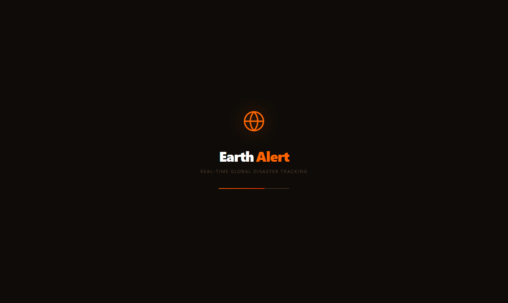
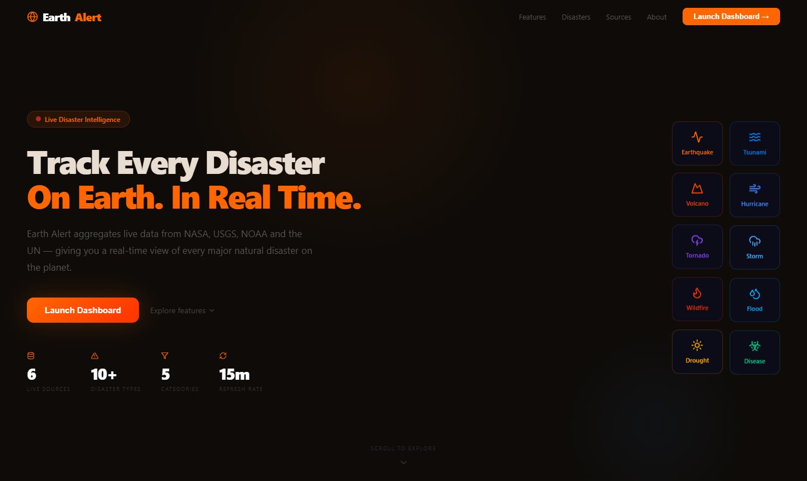
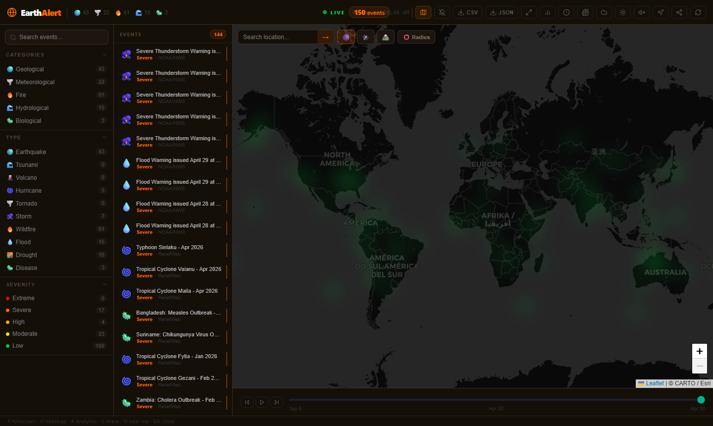
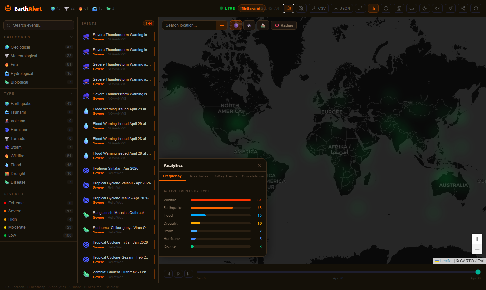
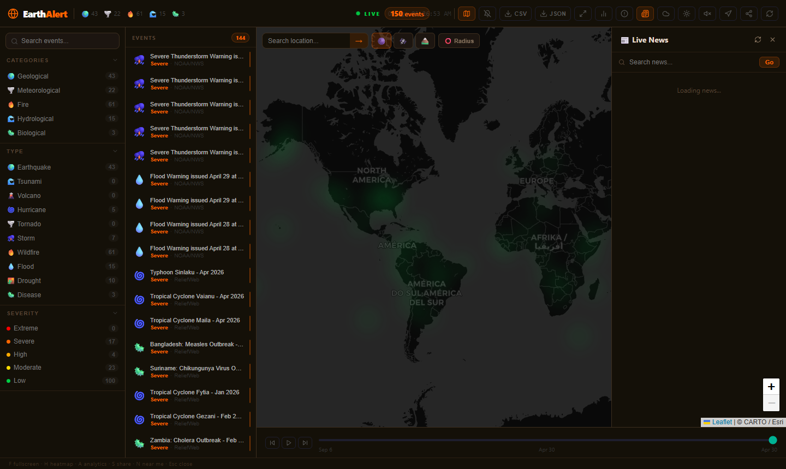
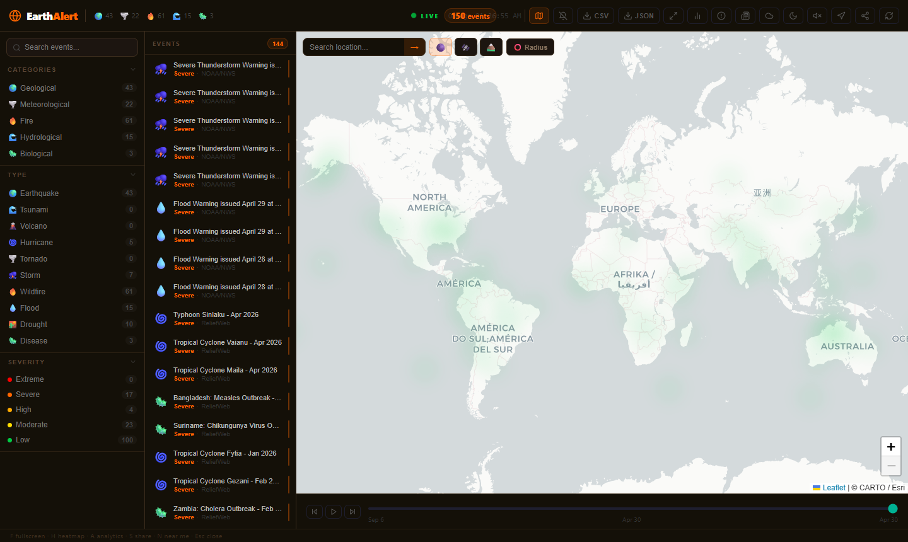

<div align="center">

# 🌍 Earth Alert

### Real-time Global Natural Disaster Intelligence Platform

[](https://github.com/Niharxd/Earth-Alert)
[](https://python.org)
[](https://fastapi.tiangolo.com)
[](https://react.dev)
[](https://vitejs.dev)
[](LICENSE)

*Aggregates live data from NASA, USGS, NOAA and the UN to deliver a real-time view of every major natural disaster on the planet.*

[Features](#-features) · [Tech Stack](#-tech-stack) · [Data Sources](#-data-sources) · [Getting Started](#-getting-started) · [API](#-api-endpoints) · [Screenshots](#-screenshots)

</div>

---

## 📸 Screenshots

<table>
  <tr>
    <td></td>
    <td></td>
  </tr>
  <tr>
    <td align="center"><em>Splash Screen</em></td>
    <td align="center"><em>Landing Page</em></td>
  </tr>
  <tr>
    <td></td>
    <td></td>
  </tr>
  <tr>
    <td align="center"><em>Dashboard Overview</em></td>
    <td align="center"><em>Event Detail Panel</em></td>
  </tr>
  <tr>
    <td></td>
    <td></td>
  </tr>
  <tr>
    <td align="center"><em>Analytics Panel</em></td>
    <td align="center"><em>Heatmap Mode</em></td>
  </tr>
  <tr>
    <td></td>
    <td></td>
  </tr>
  <tr>
    <td align="center"><em>Live News Feed</em></td>
    <td align="center"><em>Light Mode</em></td>
  </tr>
</table>

---

## ✨ Features

<table>
  <tr>
    <td>🌐 <strong>Global Coverage</strong></td>
    <td>Tracks 10 disaster types across every continent in real time</td>
  </tr>
  <tr>
    <td>⚡ <strong>Real-time Updates</strong></td>
    <td>WebSocket push updates every 15 minutes from 6 authoritative sources</td>
  </tr>
  <tr>
    <td>🗺️ <strong>Interactive Map</strong></td>
    <td>Clustered emoji markers, heatmap overlay, satellite/terrain tiles, radius tool</td>
  </tr>
  <tr>
    <td>📊 <strong>Analytics</strong></td>
    <td>7-day trends, country risk index, disaster correlations, frequency charts</td>
  </tr>
  <tr>
    <td>⚠️ <strong>Predicted Impact</strong></td>
    <td>Estimated deaths, displaced people and economic loss per event</td>
  </tr>
  <tr>
    <td>👥 <strong>Population at Risk</strong></td>
    <td>Estimates affected population within 200km of any event</td>
  </tr>
  <tr>
    <td>📰 <strong>Live News Feed</strong></td>
    <td>Disaster news from BBC World, Al Jazeera and ReliefWeb</td>
  </tr>
  <tr>
    <td>🔔 <strong>Smart Alerts</strong></td>
    <td>Custom notification rules by type, severity or magnitude</td>
  </tr>
  <tr>
    <td>🌦️ <strong>Weather Overlay</strong></td>
    <td>Precipitation, wind, temperature and cloud layers via OpenWeatherMap</td>
  </tr>
  <tr>
    <td>📍 <strong>Near Me</strong></td>
    <td>Browser geolocation to find disasters near your location</td>
  </tr>
  <tr>
    <td>⏱️ <strong>Timeline Scrubber</strong></td>
    <td>Scrub through event history with play/pause controls</td>
  </tr>
  <tr>
    <td>📤 <strong>Export</strong></td>
    <td>Download all active events as CSV or JSON</td>
  </tr>
</table>

---

## 🗂️ Tech Stack

| Layer | Technology |
|---|---|
| **Backend** | Python 3.13, FastAPI, Uvicorn |
| **Real-time** | WebSockets, APScheduler |
| **Database** | SQLite (aiosqlite) |
| **HTTP Client** | httpx (async) |
| **Data Parsing** | xmltodict, csv |
| **Frontend** | React 18, Vite 5 |
| **Map** | Leaflet, react-leaflet, leaflet.heat |
| **Routing** | React Router v6 |
| **Icons** | Lucide React |
| **Styling** | Inline styles (earthy dark theme) |

---

## 📡 Data Sources

| Source | Disaster Types | Frequency |
|---|---|---|
| [USGS Earthquake Hazards](https://earthquake.usgs.gov) | Earthquakes, Tsunamis | Real-time (minutes) |
| [NASA FIRMS](https://firms.modaps.eosdis.nasa.gov) | Wildfires | Every 12h (satellite) |
| [NOAA/NWS](https://api.weather.gov) | Storms, Tornadoes, Floods | Real-time (minutes) |
| [GDACS](https://www.gdacs.org) | Floods, Droughts, Earthquakes | Every few hours |
| [NOAA NHC](https://www.nhc.noaa.gov) | Hurricanes, Tropical Storms | Real-time (season) |
| [ReliefWeb](https://reliefweb.int) | Hurricanes, Diseases, Wildfires | Daily |

---

## 🚀 Getting Started

### Prerequisites

- Python 3.11+
- Node.js 18+
- [NASA FIRMS API key](https://firms.modaps.eosdis.nasa.gov/api/area/) — free
- [OpenWeatherMap API key](https://openweathermap.org/api) — free

### Installation

**1. Clone the repository**
```bash
git clone https://github.com/Niharxd/Earth-Alert.git
cd Earth-Alert
```

**2. Configure the backend**
```bash
cd server
cp .env.example .env
# Add your NASA_FIRMS_KEY and OWM_API_KEY to .env
pip install -r requirements.txt
```

**3. Configure the frontend**
```bash
cd client
cp .env.example .env
# Add your VITE_OWM_API_KEY to .env
npm install
```

### Running

**Windows — one click**
```
start-backend.bat
start-frontend.bat
```

**Manual**
```bash
# Terminal 1 — Backend
cd server && uvicorn main:app --reload --port 3001

# Terminal 2 — Frontend
cd client && npm run dev
```

Open **http://localhost:5173**

> 📖 Interactive API docs available at **http://localhost:3001/docs**

---

## 🔑 Environment Variables

### `server/.env`

| Variable | Description | Required |
|---|---|---|
| `NASA_FIRMS_KEY` | NASA FIRMS API key for wildfire satellite data | ✅ |
| `OWM_API_KEY` | OpenWeatherMap API key for weather tiles | ✅ |
| `PORT` | Server port (default: 3001) | ❌ |

### `client/.env`

| Variable | Description | Required |
|---|---|---|
| `VITE_OWM_API_KEY` | OpenWeatherMap API key for weather overlay | ✅ |
| `VITE_API_URL` | Backend URL (default: http://localhost:3001) | ❌ |

---

## 📁 Project Structure

```
Earth-Alert/
├── client/                        # React frontend
│   └── src/
│       ├── components/            # Map, Sidebar, DetailPanel, Navbar, etc.
│       ├── hooks/                 # useDisasters, useWebSocket, useGeolocation, etc.
│       ├── pages/                 # Splash, Landing
│       ├── services/              # API client
│       ├── constants/             # Disaster types, severity colors
│       └── context/               # Theme context
│
├── server/                        # Python backend
│   ├── services/
│   │   ├── aggregator.py          # Fetches, deduplicates and caches all sources
│   │   └── parsers/               # usgs.py, firms.py, gdacs.py, noaa.py, nhc.py, who.py
│   ├── utils/
│   │   ├── normalizer.py          # Normalizes events to common schema
│   │   ├── correlation.py         # Detects geographically linked disasters
│   │   ├── impact.py              # Predicts human and economic impact
│   │   ├── population.py          # Population at risk estimator
│   │   ├── trends.py              # 7-day trend analytics
│   │   └── countries.py           # Country centroid coordinates
│   ├── db.py                      # SQLite event history
│   └── main.py                    # FastAPI app, WebSocket, all endpoints
│
├── screenshots/                   # App screenshots
├── start-backend.bat              # One-click backend start (Windows)
├── start-frontend.bat             # One-click frontend start (Windows)
└── README.md
```

---

## 🌐 API Endpoints

| Method | Endpoint | Description |
|---|---|---|
| `GET` | `/api/disasters` | All active events |
| `GET` | `/api/disasters/type/:type` | Filter by disaster type |
| `GET` | `/api/disasters/category/:category` | Filter by category |
| `GET` | `/api/disasters/:id` | Single event detail |
| `GET` | `/api/disasters/:id/impact` | Predicted impact estimate |
| `GET` | `/api/disasters/:id/population` | Population at risk |
| `GET` | `/api/history` | Event history from database |
| `GET` | `/api/trends` | 7-day sparkline data |
| `GET` | `/api/correlations` | Geographically correlated events |
| `GET` | `/api/news` | Live disaster news articles |
| `GET` | `/api/stats` | Event statistics |
| `GET` | `/api/export` | Export events as JSON |
| `GET` | `/api/export/csv` | Export events as CSV |
| `WS` | `/ws` | WebSocket real-time event feed |

---

## ⌨️ Keyboard Shortcuts

| Key | Action |
|---|---|
| `F` | Toggle fullscreen map |
| `H` | Toggle heatmap overlay |
| `A` | Toggle analytics panel |
| `S` | Toggle share panel |
| `N` | Near me — center on your location |
| `Esc` | Close all panels |

---

## 👤 Author

<div align="center">

**Nihar Ranjan Patra**

[](mailto:niharpatra2277@gmail.com)
[](https://www.linkedin.com/in/nihar-patra-98841336a/)
[](https://github.com/Niharxd)

</div>

---

## 📄 License

This project is licensed under the [MIT License](LICENSE) — feel free to use, modify and distribute.

---

<div align="center">
  <sub>Built with ❤️ by <a href="https://github.com/Niharxd">Nihar Ranjan Patra</a></sub>
</div>
