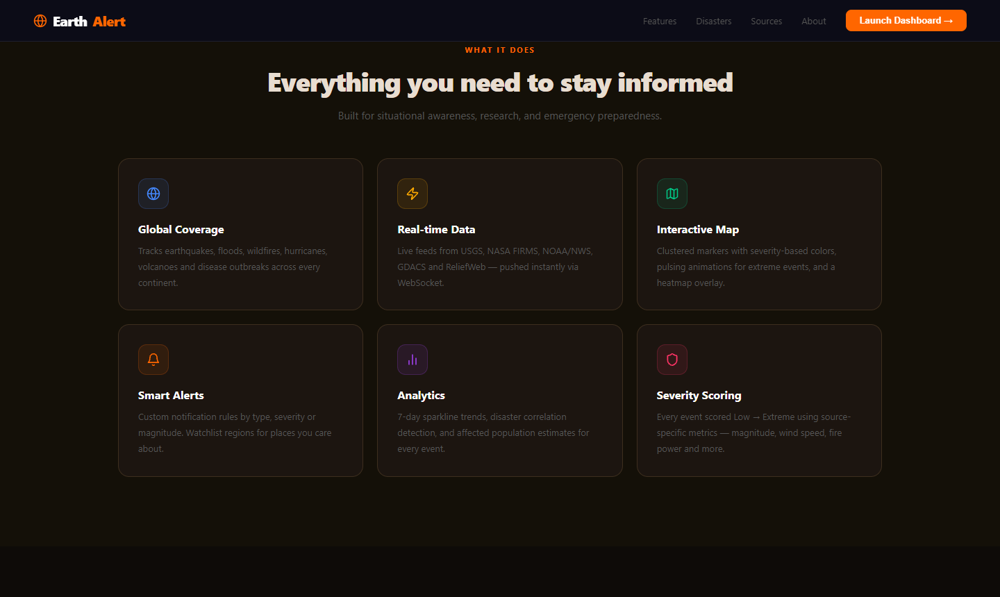
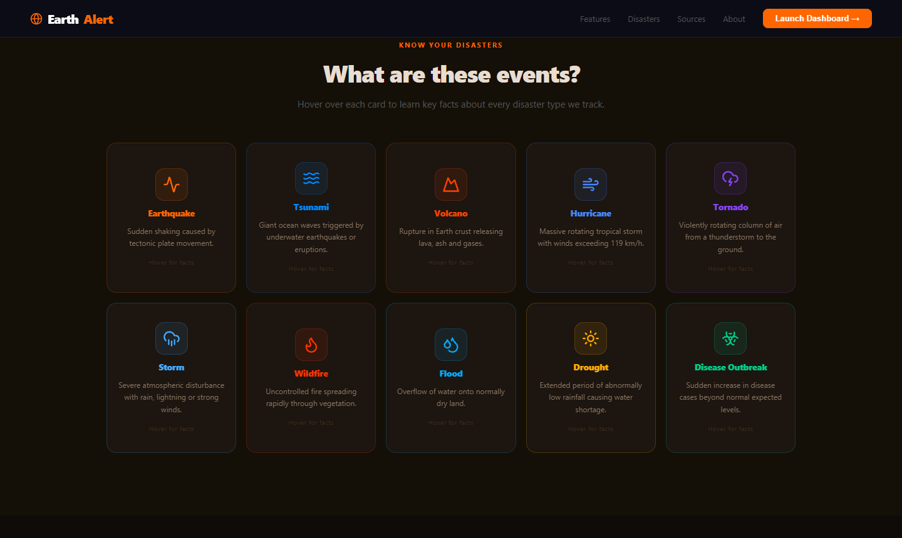
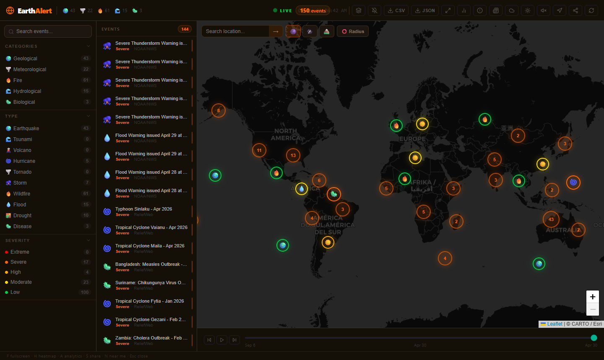

# 🌍 Earth Alert

> Real-time global natural disaster tracking dashboard

Earth Alert aggregates live data from NASA, USGS, NOAA and the UN to give you a real-time view of every major natural disaster on the planet — earthquakes, wildfires, hurricanes, floods, volcanoes, disease outbreaks and more.


---

## 📸 Screenshots

### Splash Screen


### Landing Page




### Dashboard




---

## ✨ Features

- **Real-time data** — WebSocket push updates every 15 minutes from 6 live sources
- **Interactive map** — Leaflet map with clustered emoji markers, heatmap overlay, weather layers, satellite/terrain tiles
- **10 disaster types** — Earthquake, Tsunami, Volcano, Hurricane, Tornado, Storm, Wildfire, Flood, Drought, Disease
- **5 categories** — Geological, Meteorological, Fire, Hydrological, Biological
- **Severity scoring** — Low → Extreme based on magnitude, wind speed, fire power and more
- **Analytics** — 7-day trends, country risk index, disaster correlations, frequency charts
- **Predicted impact** — Estimated deaths, displaced people and economic loss per event
- **Affected population** — Population at risk within 200km of any event
- **News feed** — Live disaster news from BBC, Al Jazeera and ReliefWeb
- **Smart alerts** — Custom notification rules by type, severity or magnitude
- **Watchlist** — Monitor specific regions or countries
- **Radius tool** — Draw a circle on the map and count events within it
- **Location search** — Search any city and fly the map there
- **Near me** — Use browser geolocation to find nearby disasters
- **Weather overlay** — OWM precipitation, wind, temperature and cloud layers
- **Timeline scrubber** — Scrub through event history
- **Export** — Download events as CSV or JSON
- **Screenshot** — Save the current map view as PNG
- **Dark/light mode** — Earthy dark theme with light mode toggle
- **Keyboard shortcuts** — F, H, A, S, N, Esc

---

## 🗂️ Tech Stack

| Layer | Technology |
|---|---|
| Backend | Python 3.13, FastAPI, uvicorn |
| Real-time | WebSockets, APScheduler |
| Database | SQLite (aiosqlite) |
| HTTP client | httpx (async) |
| Data parsing | xmltodict, csv |
| Frontend | React 18, Vite |
| Map | Leaflet, react-leaflet, leaflet.heat |
| Routing | React Router v6 |
| Icons | Lucide React |
| Styling | Inline styles (earthy theme) |

---

## 📡 Data Sources

| Source | Data | Update Frequency |
|---|---|---|
| [USGS](https://earthquake.usgs.gov) | Earthquakes, Tsunamis | Real-time (minutes) |
| [NASA FIRMS](https://firms.modaps.eosdis.nasa.gov) | Wildfires | Every 12h (satellite) |
| [NOAA/NWS](https://api.weather.gov) | Storms, Tornadoes, Floods | Real-time (minutes) |
| [GDACS](https://www.gdacs.org) | Floods, Droughts, Earthquakes | Every few hours |
| [NOAA NHC](https://www.nhc.noaa.gov) | Hurricanes, Tropical Storms | Real-time (season) |
| [ReliefWeb](https://reliefweb.int) | Hurricanes, Diseases, Wildfires | Daily |

---

## 🚀 Getting Started

### Prerequisites

- Python 3.11+
- Node.js 18+
- NASA FIRMS API key — [Get free key](https://firms.modaps.eosdis.nasa.gov/api/area/)
- OpenWeatherMap API key — [Get free key](https://openweathermap.org/api)

### Installation

**1. Clone the repository**
```bash
git clone https://github.com/Niharxd/earth-alert.git
cd earth-alert
```

**2. Set up the backend**
```bash
cd server
cp .env.example .env
# Edit .env and add your API keys
pip install -r requirements.txt
```

**3. Set up the frontend**
```bash
cd client
npm install
```

### Running

**Option 1 — Batch files (Windows)**
```
Double-click start-backend.bat
Double-click start-frontend.bat
```

**Option 2 — Manual**
```bash
# Terminal 1 — Backend
cd server
uvicorn main:app --reload --port 3001

# Terminal 2 — Frontend
cd client
npm run dev
```

Open [http://localhost:5173](http://localhost:5173)

---

## 🔑 Environment Variables

### Server (`server/.env`)

| Variable | Description | Required |
|---|---|---|
| `NASA_FIRMS_KEY` | NASA FIRMS API key for wildfire data | Yes |
| `OWM_API_KEY` | OpenWeatherMap API key for weather tiles | Yes |
| `PORT` | Server port (default: 3001) | No |

### Client (`client/.env`)

| Variable | Description | Required |
|---|---|---|
| `VITE_API_URL` | Backend URL (default: http://localhost:3001) | No |

---

## 📁 Project Structure

```
earth-alert/
├── client/                    # React frontend
│   └── src/
│       ├── components/        # UI components (Map, Sidebar, DetailPanel, etc.)
│       ├── hooks/             # Custom hooks (useDisasters, useWebSocket, etc.)
│       ├── pages/             # Landing page, Splash screen
│       ├── services/          # API service
│       ├── constants/         # Disaster types, severity colors
│       └── context/           # Theme context
│
├── server/                    # Python backend
│   ├── services/
│   │   ├── aggregator.py      # Fetches all sources, deduplicates, caches
│   │   └── parsers/           # One parser per data source
│   ├── utils/
│   │   ├── normalizer.py      # Normalizes all events to common schema
│   │   ├── correlation.py     # Detects geographically linked disasters
│   │   ├── impact.py          # Predicts human/economic impact
│   │   ├── population.py      # Population at risk estimator
│   │   ├── trends.py          # 7-day trend analytics
│   │   └── countries.py       # Country centroid coordinates
│   ├── db.py                  # SQLite event history
│   └── main.py                # FastAPI app, WebSocket, all endpoints
│
├── start-backend.bat          # One-click backend start (Windows)
├── start-frontend.bat         # One-click frontend start (Windows)
└── README.md
```

---

## 🌐 API Endpoints

| Method | Endpoint | Description |
|---|---|---|
| GET | `/api/disasters` | All active events |
| GET | `/api/disasters/type/:type` | Filter by type |
| GET | `/api/disasters/category/:category` | Filter by category |
| GET | `/api/disasters/:id` | Single event |
| GET | `/api/disasters/:id/impact` | Predicted impact |
| GET | `/api/disasters/:id/population` | Population at risk |
| GET | `/api/history` | Event history from DB |
| GET | `/api/trends` | 7-day sparkline data |
| GET | `/api/correlations` | Correlated event pairs |
| GET | `/api/news` | Live disaster news |
| GET | `/api/stats` | Event statistics |
| GET | `/api/export` | Export as JSON |
| GET | `/api/export/csv` | Export as CSV |
| WS  | `/ws` | WebSocket real-time feed |

Interactive API docs available at [http://localhost:3001/docs](http://localhost:3001/docs)

---

## ⌨️ Keyboard Shortcuts

| Key | Action |
|---|---|
| `F` | Toggle fullscreen map |
| `H` | Toggle heatmap |
| `A` | Toggle analytics panel |
| `S` | Toggle share panel |
| `N` | Near me (geolocation) |
| `Esc` | Close all panels |

---

## 👤 Author

**Nihar Ranjan Patra**

- 📧 [niharpatra2277@gmail.com](mailto:niharpatra2277@gmail.com)
- 💼 [LinkedIn](https://www.linkedin.com/in/nihar-patra-98841336a/)
- 🐙 [GitHub](https://github.com/Niharxd)

---

## 📄 License

MIT License — feel free to use, modify and distribute.
